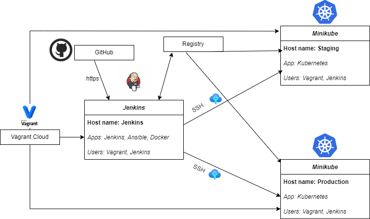
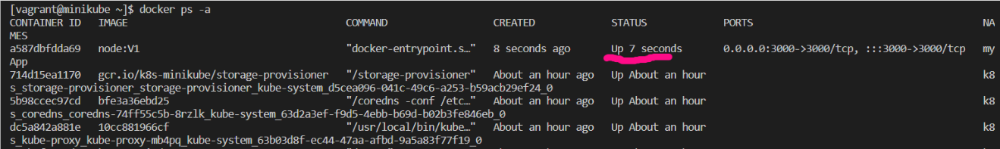
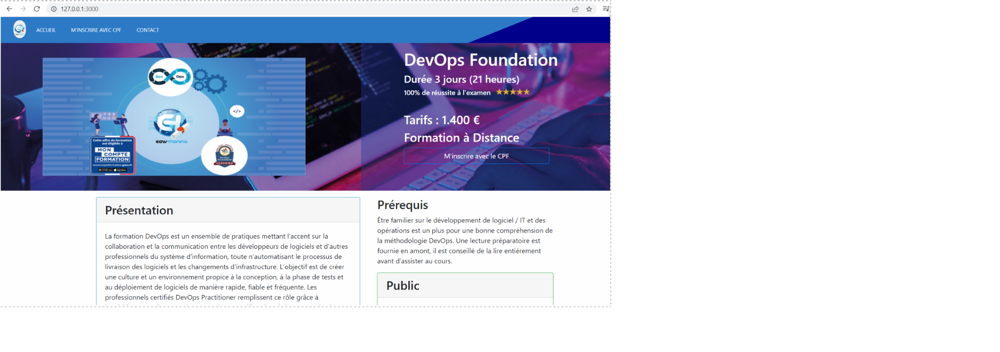
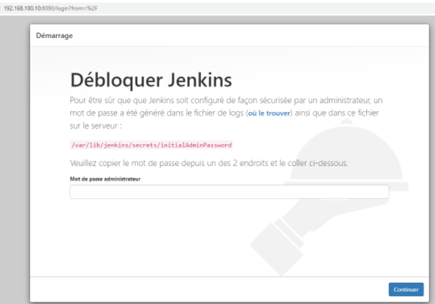
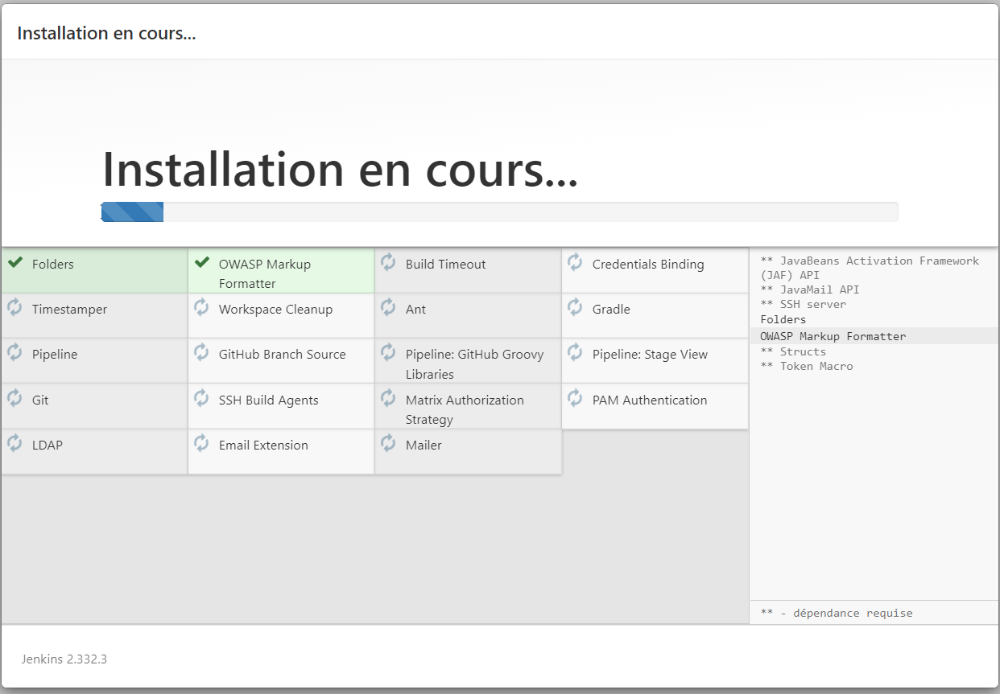
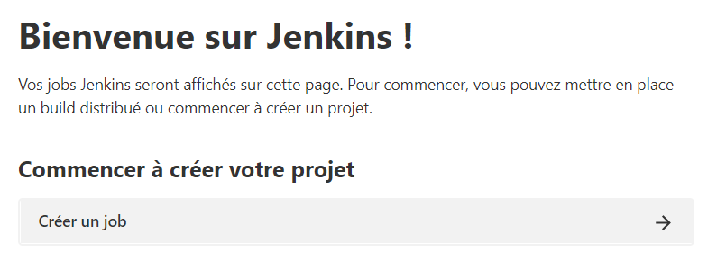

# eazytraining : création d'une CI/CD pour l'application nodeJS de formation

[Les attendus](./README_goal.MD)

**1. Récupération du repo de travail et installation**

```sh
Setup Git
   mkdir 'PROJET' && cd './PROJET'
   git clone https://github.com/ulrichmonji/Groupe1
   git remote add repo_perso https://github.com/[GIT_ID]/repo_perso.git
   git remote -v
   git add .
   git commit -m "first commit"
   git status
   git push repo_perso
   git remote add upstream https://github.com/[GIT_ID]/repo_perso.git
   ```
**2. Outils travail d'équipe**

- Partage de dossier de travail dans one drive (outils bureautiques Microsoft)
- Discussion Discord pour la gestion travail à distance, disponibilité des outils de chat, vidéo et partage d’écran
- Epic Pen pour annotations graphiques des captures d’écran

**3. Choix des outils techniques**

Parmi les propositions :

- Jenkins : automatisation du build / test / deploy 
Permet la gestion de la CI/CD en un seul fichier [Jenkinsfile](./Jenkinsfile)
- Minikube : pour une installation facilité de cluster Kubernetes pour la version locale de test
- Ansible : pour la gestion simplifiée des conteneurs Docker depuis les playbooks et la sécurité (OpenSSH)

**4. Infrastructure**



**5. Prérequis NodeJS**

La machine doit avoir une installation de NodeJS avec la version node:14.16 conseillée

```sh
npm install npm@14.16.0
npm install nodemon # Installation d'un daemon
npm start # Run de l’application
```
L'application se lance en local sur http://localhost:3000

**6. Docker**

Pour tester le deploiement de l'application dans un conteneur Docker
On est parti sur la base du Vagrant [Cursus DevOps](https://github.com/diranetafen/cursus-devops/tree/master/vagrant/docker)

```sh
docker run -d --name myApp -p 3000:3000 node:V1 # lancement de notre image de test node:v1
docker ps –a # vérification du status "up"
```



Test de réponse sur l'URL
```
curl http://192.168.100.10:3000/ -I 
```

Depuis le navigateur



---> Réalisation du [Dockerfile](./Dockerfile)

Pour finir, prise en compte de Docker dans l'installation depuis Vagrant (voir le fichier [install_minikube](./VAGRANT/install_minikube.sh) )

```sh
# install docker
curl -fsSL https://get.docker.com -o get-docker.sh
sh get-docker.sh
usermod -aG docker vagrant

# Start Docker
systemctl enable docker
systemctl start docker
```

**7. Jenkins**

Nos 3 machines :

- Un Jenkins avec les outils : Jenkins/ansible/K8S en baremetal

- Une staging 

- Une Prod 

Création d'un pipeline en fonction ( voir [Jenkinsfile](./Jenkinsfile) )

Pour la configuration de la plateforme

```sh
vagrant ssh jenkins # connexion en ssh sur la machine Jenkins
```
Dans le navigateur: http://192.168.100.10:8080


```sh
sudo cat /var/lib/jenkins/secrets/initialAdminPassword # récupération du mdp administrateur
```

Installation des plugins et création de l'utilisateur principal



La plateforme est prête pour notre premier job !



